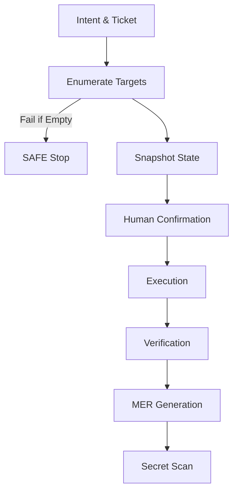

[](https://doi.org/10.5281/zenodo.18896883)

# SAFE Intent Framework

SAFE (Structured Automation For Execution) is a control framework for AI-assisted administrative automation.

It introduces a structured execution model that ensures automation involving privileged systems follows enforceable operational phases. These phases establish scope, capture state, require confirmation, and produce auditable execution artifacts.

The framework is intended for environments where automation interacts with operational infrastructure such as identity systems, tenant policy management, endpoint fleets, or network access controls.

Preprint (RFC-style), February 2026. Archived on Zenodo.

## Problem

AI-assisted operational tools can generate scripts or commands capable of modifying production systems. Without structural safeguards, automation may execute actions that are ambiguous in scope, insufficiently verified, or difficult to audit after execution.

SAFE introduces a structured control loop that enforces operational discipline before and after changes are executed.

## SAFE Control Phases

The SAFE model defines a minimal operational control sequence:

1. Enumeration  
2. Snapshot  
3. Confirmation  
4. Execution  
5. Verification  
6. MER generation  

Each phase produces artifacts that allow traceability and post-execution analysis. The resulting record is called a MER (Minimal Evidence Record).

## SAFE Control Flow



## Repository Structure

```
safe-intent-framework/

docs/
  SAFE RFC and documentation materials

poc/
  reference proof-of-concept implementation

examples/
  demonstration command runs

tests/
  minimal tests for helper scripts

scripts/
  development utilities
```

## Reference Implementation

This repository includes a minimal SAFE-L2 reference wrapper located at:

```
poc/safe-l2-wrapper/
```

The wrapper demonstrates enforceable phase ordering, scope binding between phases, confirmation gating for high-risk actions, evidence bundle generation, and MER artifact creation.

The wrapper is intentionally minimal. It is not intended to be an industrial-grade security product. Its purpose is to demonstrate SAFE control semantics.

## Example Usage

Example invocation of the reference wrapper:

```bash
python safe_l2_reference_wrapper.py \
  --env prod \
  --change-class iam \
  --risk-tier high \
  --intent "Disable legacy auth for tenants in OU=Sales" \
  --ticket "CHG-12345" \
  --enumerate 'python enumerate_targets.py' \
  --snapshot 'python snapshot_state.py --targets-file {targets_ref}' \
  --execute 'python apply_change.py --targets-file {targets_ref}' \
  --verify 'python verify_state.py --targets-file {targets_ref}' \
  --secret-scan-cmd 'python secret_scan.py --dir {evidence_dir}'
```

## Licensing

This repository contains components released under different licenses.

| Directory | License |
|----------|--------|
| docs/ | CC BY-SA 4.0 |
| poc/safe-l2-wrapper/ | Apache License 2.0 |
| poc/sample-scripts/ | MIT |

Full license texts are available in the `LICENSES/` directory.

## Persistent identifier

DOI (v1.1): 10.5281/zenodo.18896884  
DOI (all versions): 10.5281/zenodo.18896883  

## Citation

If you reference this framework in research or technical work, please cite the Zenodo record.

**Versioned citation (pins v1.1):**  
Corral, R. S. J. (2026). *SAFE Intent Framework* (v1.1) [Preprint]. Zenodo.  
DOI: 10.5281/zenodo.18896884

**All versions (concept DOI, resolves to latest):**  
DOI: 10.5281/zenodo.18896883

Citation metadata is also available in `CITATION.cff`.

## Status

SAFE is currently a research prototype and reference implementation. The included wrapper demonstrates the framework semantics but does not represent a production-ready system.

## Author

Rogel S.J. Corral  
Independent Researcher
